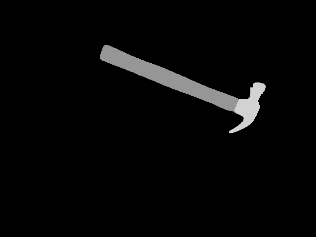

# Convert labelme format to affordance format

## Installation
```bash
conda create -n py3.10 python==3.10
conda activate py3.10
pip install labelme
pip install opencv-python-headless==4.12.0.88
```

## Usage
### Example
```bash
python labelme2aff.py --input_dir data/  --output_dir data_aff/
```

### Output
After running the script, the following will be generated:
* The original RGB image
* The object bounding box
* Individual affordance masks for each object
 

### Result Preview
|RGB Image|Object 1|
:---:|:---:|
|  |  |
|Object 2|Object 3|
|  |  |
